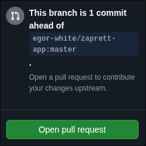

# zaprett-repo

## Зачем нужен данный репозиторий?
* Для хранения списков доменов, которые можно скачивать из [приложения](https://github.com/CherretGit/zaprett-app)
* Для хранения стратегий обхода, которые также можно скачивать из [приложения](https://github.com/CherretGit/zaprett-app)

## Как загрузить свои списки/стратегии
1. Сначала нужно [создать форк](https://github.com/CherretGit/zaprett-hosts-repo/fork) данного репозитория.
2. Затем внести изменения — в новый или существующий файл. Название файла должно начинаться с `list-` или `strategy-`.  
   **ВАЖНО**: в списки нужно вносить **все** домены, а не только домен главной страницы. Например:

   **НЕПРАВИЛЬНО**:
   ```
   youtube.com
   ```

   **ПРАВИЛЬНО**:
   ```
   googlevideo.com  
   youtubei.googleapis.com  
   youtube.com  
   ggpht.com  
   ytimg.com  
   youtu.be  
   yt.be  
   ```

3. После внесения изменений откройте вкладку **Actions**  и убедитесь, что у вас отображается что-то похожее на этот скриншот: 

4. Затем откройте файл `hosts.json` или `strategies.json` (в зависимости от того, что вы редактировали), найдите ваш файл и отредактируйте следующие поля:
   ```json
   {
     "name": "название вашего файла (это поле менять не нужно)",
     "author": "автор",
     "description": "описание файла",
     "hash": "это поле менять не нужно",
     "url": "это поле менять не нужно"
   }
   ```

5. После выполнения всех шагов на главной странице репозитория появится плашка . Нажмите **Contribute** , затем — **Open pull request**.

## Готово!
Мы проверим ваш pull request, и если всё в порядке, опубликуем ваши изменения.
